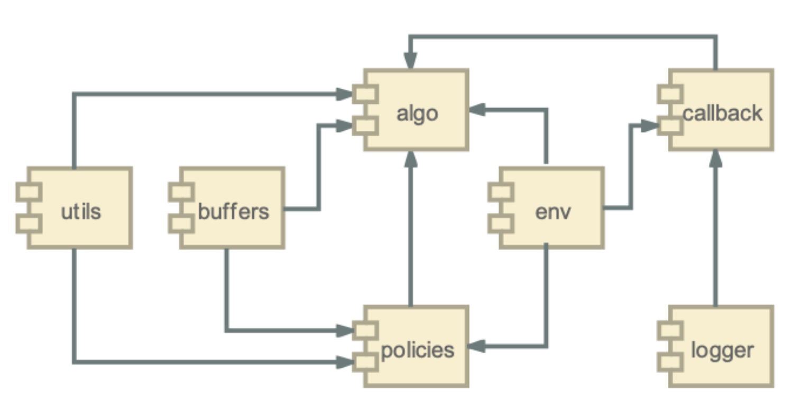

# eve-mli: making learning interesting 


 [](https://eve-mli.readthedocs.io/en/latest/?badge=latest) [](https://pypi.org/project/eve-mli) [](https://pypi.org/project/eve-mli)

Eve is an open-source deep learning framework used to devise various architectures in a more flexible and interesting way.

We provide a jupyter notebook to show the basic usage and the advanced features of Eve in `./examples`.

**Any contributions to Eve is welcome!**

## Installation

Install from [PyPI](https://pypi.org/project/eve-mli/):

```bash
pip install eve-mli
```

Developers can download and install the latest version from

[GitHub](https://github.com/densechen/eve-mli):

```bash
git clone https://github.com/densechen/eve-mli.git
cd eve-mli
python setup.py install
```

or [Gitee](https://gitee.com/densechen/eve-mli.git):
```bash
git clone https://gitee.com/densechen/eve-mli.git
cd eve-mli
python setup.py install
```

Vailidate installation:

```bash
python -c "import eve; print(eve.__version__)"
```

*Currently, the APIs may be changed frequently. Install directly from github is suggested.*

## About the project

This project is mainly based on [PyTorch](https://github.com/pytorch/pytorch) and [stable-baselines3](https://github.com/DLR-RM/stable-baselines3).
*eve.Cores.Eve* succeeds *torch.nn.Module* and keeps all the features of latter.
We design a *Trainer* to maintain training process and further wrapper it as a *gym.envs* to play with reinforcement learning.

The documentation can be found [here](https://eve-mli.readthedocs.io).
(Auto-building of documentation may fail sometimes, you can build it manually via ```cd docs; make html```)

## About the authors

[Dengsheng Chen](https://densechen.github.io)
Master @ National University of Defense Technology
densechen@foxmail.com

The project remains in development. We encourage more volunteers to come together, and make learning more interesting!

## Next to do

GOOD NEWS: all the basic functions and modules have been tested, and we will to rewrite some code to make the framework more easier to use in the next serval weeks. 

**The first official version of eve-mli will be released very soon.**

## Folder Structure

```bash
eve
├── app
│   ├── algo.py # base class for online and offline policy algorithm.
│   ├── algorithm
│   │   ├── a2c.py
│   │   ├── ddpg.py
│   │   ├── dqn.py
│   │   ├── __init__.py
│   │   ├── ppo.py
│   │   ├── sac.py
│   │   └── td3.py
│   ├── buffers.py # replay buffer and rollout buffer
│   ├── callbacks.py 
│   ├── env.py # wrapper EveEnv
│   ├── exp_manager.py # manage the train of RL.
│   ├── hyperparams_opt.py # hyperparams of opt
│   ├── __init__.py
│   ├── logger.py 
│   ├── model.py # the base model to define a network for trainer
│   ├── policies.py # basic actor and critic network structure
│   ├── space.py # EveSpace, which is a re-wrapper of gym.Space
│   ├── trainer.py # basic class for train differnt model
│   ├── upgrader.py # the upgrader is used to control the eve_parameter like optimizer used to update torch_parameter
│   └── utils.py
├── core
│   ├── eve.py # wrapper nn.Module to Eve
│   ├── __init__.py
│   ├── layer.py # define various layers.
│   ├── node.py # IFNode and LIFNode, used in spiking neural network.
│   ├── quan.py # Quantizer
│   ├── quantize_fn.py
│   ├── state.py # The class to fetch different runtime state of feature.
│   └── surrogate_fn.py
├── __init__.py
└── utils
    ├── __init__.py
    └── legacy.py
```

## Frameworks


